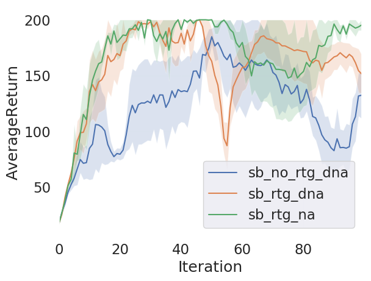
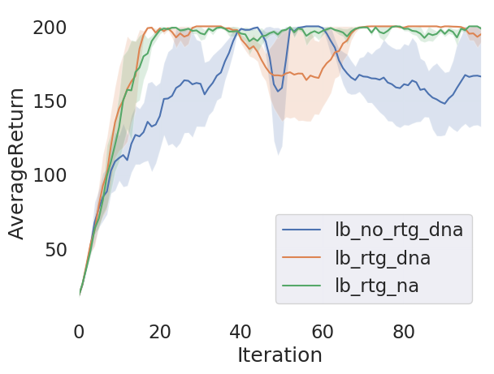
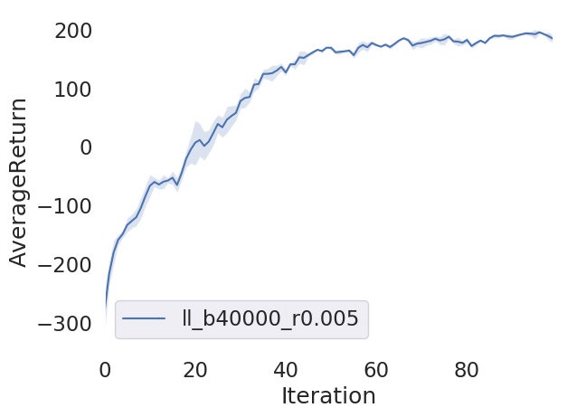
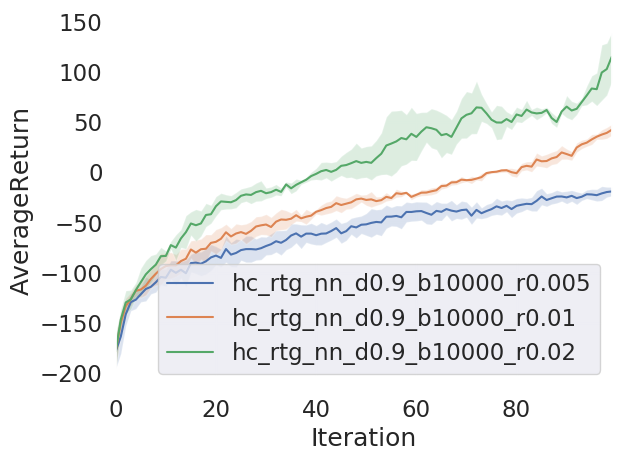
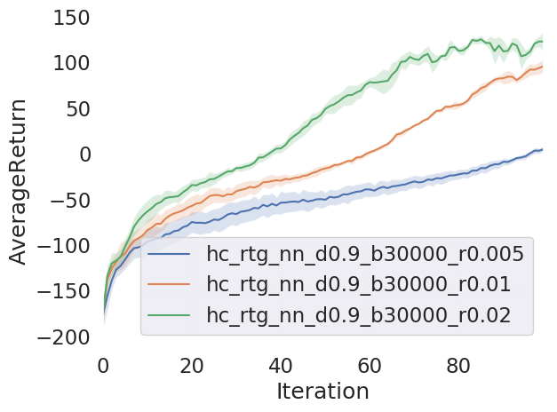
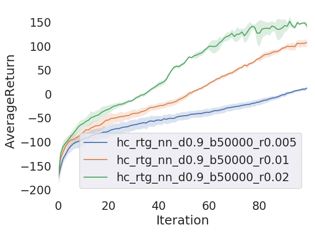
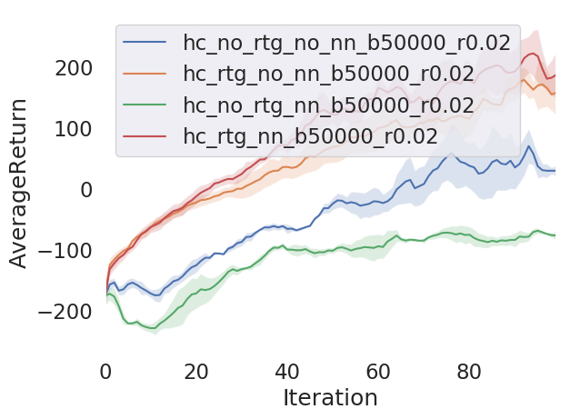

# CS294-112 HW 2: Policy Gradient

## Usage
To run all experiments and generate all the plots presented in this report, run the following commands from
homework 2's root directory:
```bash
scripts/run_4.sh
scripts/run_5.sh
scripts/run_7.sh
scripts/run_8.sh
scripts/run_8star.sh
``` 

## Problem 4
<p float="left">
  
  
</p>

- Reward-to-go allows to model to converge faster, and towards a better performance.
- Advantage centering helps reduce the variance after first converging.
- Large batch size also helps reduce the variance.

## Problem 5
The hyperparameter values tested where batch size ∈ [500, 1000, 2000], and learning rate ∈ [0.005, 0.01, 0.02].
The best results (least variance with good value at convergence) were achieved with a batch size of 2000 and a
learning rate of 0.02. 
<p float="left">
  
</p>

## Problem 7
<p float="left">
  
</p>

## Problem 8
<p float="left">
  
  
  
</p>

The best performance seems to have been achieved when using a batch size of 50000 and a learning rate of 0.02.
Using those parameters, the experiments with a discount of 0.95 gave the following results.

<p float="left">
  
</p>